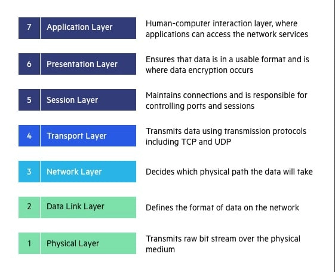

# OSI Model
> The Open Systems Interconnection model is responsible for creating a communication path over a network between two systems. It uses seven layers and those seven layers have some unique responsibility to make a digital request to convert an analog and analog to digital so that communication happens. 

## List of OSI Model
- ### Application Layer
- ### Presentation Layer

## Application Layer
> Application layer is used by network application like chrome, firefox or other web browser and those application does not reside in the application layer but they used application layer protocol to work. Application layer provides some protocol like HTTP/S, FTP, SMTP, TELENET, POP3 and etc. to perform user activities.

## Presentation Layer
> Presentation layer receives data from the Application layer in the form of numbers and characters and it converts them to binary format. This conversion is called translation and also compressed data lossless or lossy manners so that data transmission can be done faster. Also before transmission data is encrypted and enhanced the security of data. SSL is used for data encryption/decryption.

